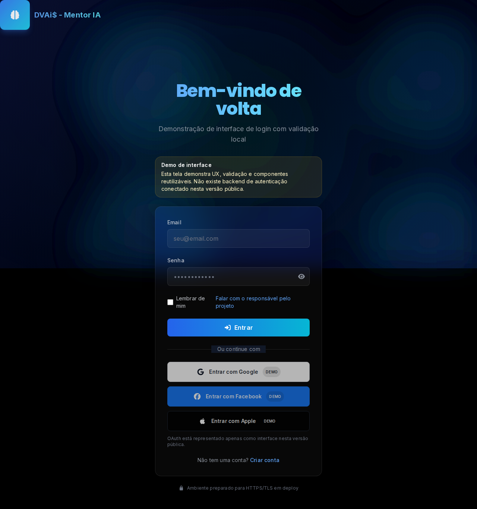

# DVAi$ - Mentor IA

> Assistente contextual em Next.js e TypeScript, com navegação por voz/clique, validação de ações e uma camada técnica pensada para produto web corporativo.

Este repositório é uma vitrine técnica honesta. Ele mostra um protótipo funcional de interface e arquitetura, mas não vende backend de autenticação real, IA local produtiva nem análise de mercado em tempo real comprovada.

## O que é

O DVAi$ - Mentor IA é uma aplicação web construída para demonstrar um assistente contextual com foco em orientação guiada. O núcleo técnico combina base de conhecimento, validação de intenção/ações, fallback para LLM e proteções operacionais como cache, rate limit e circuit breaker.

O repositório também inclui telas públicas de login e cadastro como demo de interface. Essas telas validam formulário no cliente, mas não se conectam a um backend de autenticação nesta versão.

## Funcionalidades reais

- Assistente contextual com entrada por texto, clique e voz.
- Fluxo `KB-first` com fallback para LLM quando necessário.
- Validação e sanitização de ações antes de executar respostas.
- Cache, rate limit e circuit breaker para proteger integrações instáveis.
- Formulários com validação de dados no cliente, incluindo CPF e telefone internacional.
- Métricas de `Web Vitals`, health check e endpoints de suporte operacional.
- Interface responsiva e adaptada para desktop e mobile.
- Configuração de `PWA` e deploy pensado para `Vercel`.

## Stack

- `Next.js 14`
- `TypeScript`
- `React 18`
- `Tailwind CSS`
- `Zod`
- `Vitest`
- `Playwright`
- `Vercel`

## Arquitetura

- `app/`: rotas, páginas públicas e endpoints.
- `componentes/`: UI principal, incluindo hero, header, footer, assistente e formulários.
- `biblioteca/`: módulos de domínio, validação, cache, rate limit, circuit breaker e logging.
- `tests/`: testes unitários e E2E.
- `public/`: assets estáticos, manifest e workers.

O fluxo principal do assistente usa base de conhecimento antes de consultar um modelo externo. Isso reduz ruído, melhora previsibilidade e deixa a integração mais resiliente.

## Como rodar

```bash
npm install
npm run dev
```

Depois, abra `http://localhost:3000`.

## Testes

```bash
npm run lint
npm run test:unit
npm run build
npm run test:e2e
```

Verificações já previstas no projeto:

- `lint`, `test:unit` e `build` são os sinais principais de saúde.
- `test:e2e` cobre a navegação e a vitrine visual.
- Há snapshot visual para home e login; ele é útil para checar regressões de layout, mas não representa uma garantia de produto pronto.

## Limitações

- Não existe backend real de autenticação nesta versão.
- As telas de login/cadastro são demo de interface e validação local.
- O projeto não prova IA local produtiva em produção.
- O discurso de mercado em tempo real não deve ser interpretado como promessa operacional real.
- Algumas páginas públicas são propositalmente demonstrativas e servem mais para portfólio do que para operação final.

## Próximos passos

- Separar melhor a camada do assistente em módulos menores.
- Implementar autenticação real ou remover completamente a narrativa de login/cadastro.
- Criar uma experiência mobile-first mais explícita para uso em campo.
- Reduzir bundle inicial e melhorar o custo percebido da landing.
- Substituir páginas demonstrativas por fluxos operacionais reais, se o projeto evoluir para produto.

## Screenshots

Capturas curadas do estado atual do projeto:




## Descrição curta para GitHub

Assistente contextual em Next.js/TypeScript com voz, clique e validação de ações, combinando base de conhecimento, fallback LLM, cache, rate limit, circuit breaker, testes automatizados e uma vitrine honesta para portfólio técnico.

## Autor

Thiago Caetano Faria
